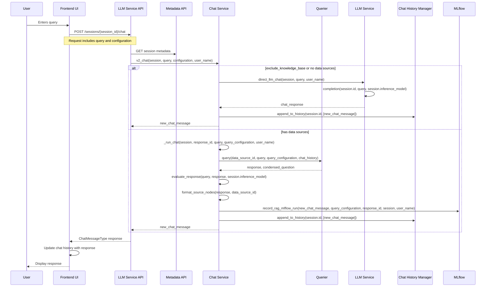

```mermaid
sequenceDiagram
    participant User
    participant UI as Frontend UI
    participant API as LLM Service API
    participant MetadataApi as Metadata API
    participant ChatService as Chat Service
    participant Querier as Querier
    participant LLM as LLM Service
    participant ChatHistory as Chat History Manager
    participant MLflow as MLflow

    User->>UI: Enters query
    UI->>API: POST /sessions/{session_id}/chat
    Note over UI,API: Request includes query and configuration

    API->>MetadataApi: GET session metadata
    API->>ChatService: v2_chat(session, query, configuration, user_name)

    alt exclude_knowledge_base or no data sources
        ChatService->>LLM: direct_llm_chat(session, query, user_name)
        LLM->>LLM: completion(session.id, query, session.inference_model)
        LLM-->>ChatService: chat_response
        ChatService->>ChatHistory: append_to_history(session.id, [new_chat_message])
        ChatService-->>API: new_chat_message
    else has data sources
        ChatService->>ChatService: _run_chat(session, response_id, query, query_configuration, user_name)
        ChatService->>Querier: query(data_source_id, query, query_configuration, chat_history)
        Querier-->>ChatService: response, condensed_question
        ChatService->>ChatService: evaluate_response(query, response, session.inference_model)
        ChatService->>ChatService: format_source_nodes(response, data_source_id)
        ChatService->>MLflow: record_rag_mlflow_run(new_chat_message, query_configuration, response_id, session, user_name)
        ChatService->>ChatHistory: append_to_history(session.id, [new_chat_message])
        ChatService-->>API: new_chat_message
    end

    API-->>UI: ChatMessageType response
    UI->>UI: Update chat history with response
    UI-->>User: Display response
```
