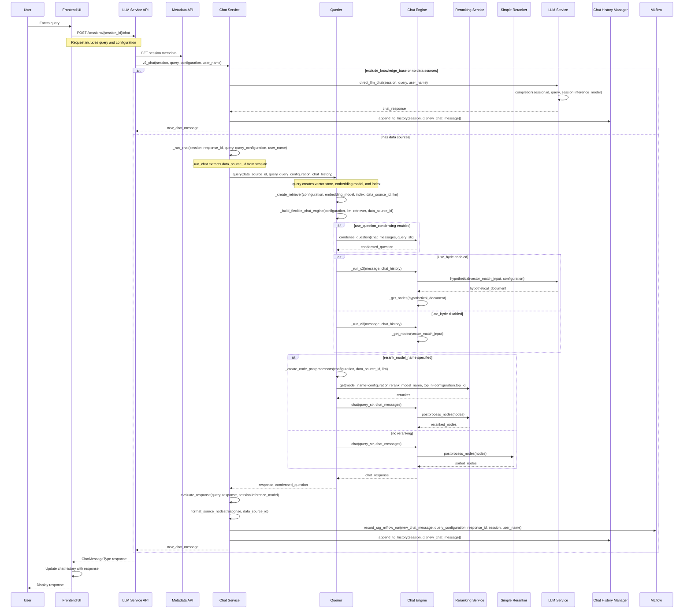

```mermaid
sequenceDiagram
    participant User
    participant UI as Frontend UI
    participant API as LLM Service API
    participant MetadataApi as Metadata API
    participant ChatService as Chat Service
    participant Querier as Querier
    participant FlexibleContextChatEngine as Chat Engine
    participant Reranking as Reranking Service
    participant SimpleReranker as Simple Reranker
    participant LLM as LLM Service
    participant ChatHistory as Chat History Manager
    participant MLflow as MLflow

    User->>UI: Enters query
    UI->>API: POST /sessions/{session_id}/chat
    Note over UI,API: Request includes query and configuration

    API->>MetadataApi: GET session metadata
    API->>ChatService: v2_chat(session, query, configuration, user_name)

    alt exclude_knowledge_base or no data sources
        ChatService->>LLM: direct_llm_chat(session, query, user_name)
        LLM->>LLM: completion(session.id, query, session.inference_model)
        LLM-->>ChatService: chat_response
        ChatService->>ChatHistory: append_to_history(session.id, [new_chat_message])
        ChatService-->>API: new_chat_message
    else has data sources
        ChatService->>ChatService: _run_chat(session, response_id, query, query_configuration, user_name)
        Note over ChatService: _run_chat extracts data_source_id from session
        ChatService->>Querier: query(data_source_id, query, query_configuration, chat_history)
        Note over Querier: query creates vector store, embedding model, and index
        Querier->>Querier: _create_retriever(configuration, embedding_model, index, data_source_id, llm)
        Querier->>Querier: _build_flexible_chat_engine(configuration, llm, retriever, data_source_id)

        alt use_question_condensing enabled
            Querier->>FlexibleContextChatEngine: condense_question(chat_messages, query_str)
            FlexibleContextChatEngine-->>Querier: condensed_question
        end

        alt use_hyde enabled
            Querier->>FlexibleContextChatEngine: _run_c3(message, chat_history)
            FlexibleContextChatEngine->>LLM: hypothetical(vector_match_input, configuration)
            LLM-->>FlexibleContextChatEngine: hypothetical_document
            FlexibleContextChatEngine->>FlexibleContextChatEngine: _get_nodes(hypothetical_document)
        else use_hyde disabled
            Querier->>FlexibleContextChatEngine: _run_c3(message, chat_history)
            FlexibleContextChatEngine->>FlexibleContextChatEngine: _get_nodes(vector_match_input)
        end

        alt rerank_model_name specified
            Querier->>Querier: _create_node_postprocessors(configuration, data_source_id, llm)
            Querier->>Reranking: get(model_name=configuration.rerank_model_name, top_n=configuration.top_k)
            Reranking-->>Querier: reranker
            Querier->>FlexibleContextChatEngine: chat(query_str, chat_messages)
            FlexibleContextChatEngine->>Reranking: postprocess_nodes(nodes)
            Reranking-->>FlexibleContextChatEngine: reranked_nodes
        else no reranking
            Querier->>FlexibleContextChatEngine: chat(query_str, chat_messages)
            FlexibleContextChatEngine->>SimpleReranker: postprocess_nodes(nodes)
            SimpleReranker-->>FlexibleContextChatEngine: sorted_nodes
        end

        FlexibleContextChatEngine-->>Querier: chat_response
        Querier-->>ChatService: response, condensed_question
        ChatService->>ChatService: evaluate_response(query, response, session.inference_model)
        ChatService->>ChatService: format_source_nodes(response, data_source_id)
        ChatService->>MLflow: record_rag_mlflow_run(new_chat_message, query_configuration, response_id, session, user_name)
        ChatService->>ChatHistory: append_to_history(session.id, [new_chat_message])
        ChatService-->>API: new_chat_message
    end

    API-->>UI: ChatMessageType response
    UI->>UI: Update chat history with response
    UI-->>User: Display response
```
