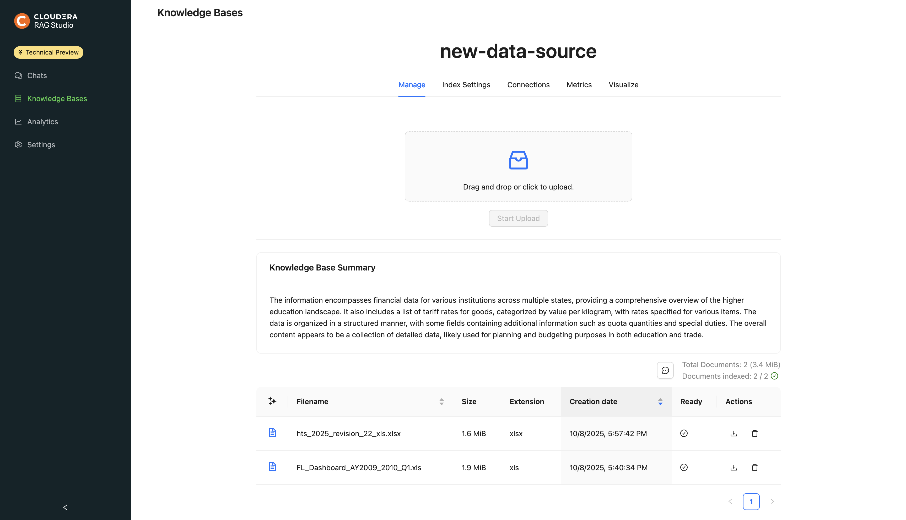
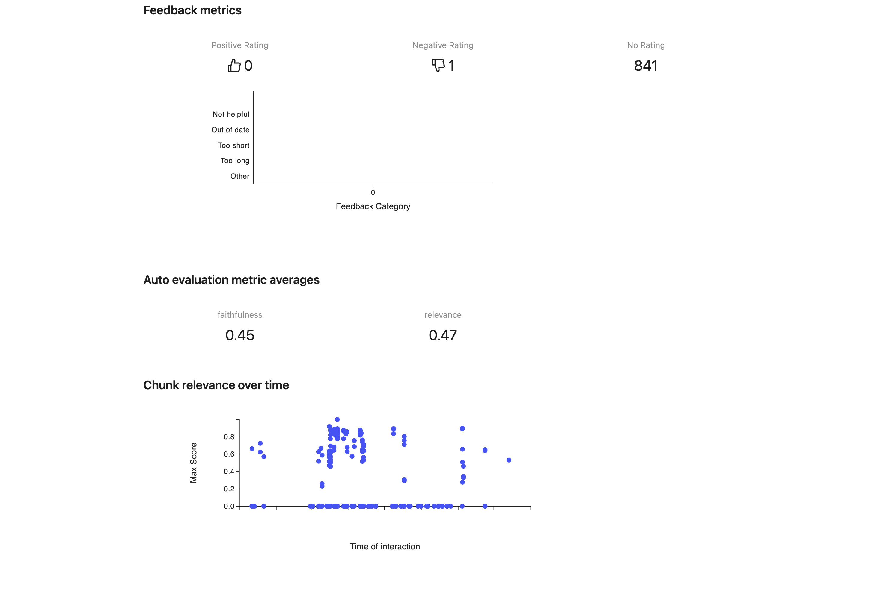

### RAG Studio Quickstart (UI)

Follow this checklist to get productive fast.

---

### 1) Open the app

Landing Page:

## 

Note on configuration (CML + CAII):

- If your CML deployment and CAII (Cloudera AI Inference) endpoints (LLM, Embeddings, Rerankers) are in the same environment, the app validates Studio configuration with CAII.
- If no valid configuration is detected, after clicking “Get started” you will be redirected to Settings to configure the Studio.

## 

### 2) Create a knowledge base

1. Go to “Knowledge Bases”. Click “Create Knowledge Base”.
2. Fill required fields: Name, Chunk size, Embedding model.
3. Optional: Select a Summarization model.
4. Save.

## 

---

### 3) Upload documents

1. Open the knowledge base → “Manage” tab.
2. Drag-and-drop or select files, then click “Start Upload”.
3. Confirm the uploaded files appear in the table.

## 

---

### 4) Start a chat

1. Go to “Chats”.
2. In the input box, type a question.
3. Send the message (Enter or click send). If no session exists, it will be created automatically on first send.
4. Optional before sending: click “Chat Settings” to open the Create Session modal and preselect knowledge base(s) and response model.

Tips:

- Use the KB selector (when creating a new session) next to the input to pick knowledge bases.
- Use the model selector next to the input to choose the response model.
- Toggle the database icon to include/exclude the knowledge base per message.
- Use the stop icon to cancel streaming.
- Click suggested questions to continue the conversation.

Suggested questions:

- If a session is created with no messages, you’ll see Suggested Questions in the chat body (KB-aware when KBs are selected; default list if none).
- After you send a message, follow-up suggestions appear after the response.

## 

## 

---

### 5) Tune chat settings (optional)

1. Click “Chat Settings” in the chat header.
2. Adjust: session name, knowledge bases, response model, rerank model, max docs, and advanced options (Tool Calling, HyDE, Summary Filter, Disable Streaming).
3. Save.

## 

---

### 6) Use Tools (beta, optional)

- Enable Tool calling from Chat Settings.
- If Tool Calling is enabled, click the wrench icon → select tools.
- Manage available tools in Settings → Tools.

## 

---

### 7) Review analytics (optional)

1. Open “Analytics”.
2. Review App Metrics and Session Metrics.
3. Filter by model, reranker (or None), summary filter usage, HyDE, knowledge-base usage, project.

## 

## 

---

### Troubleshooting

- No embedding models available when creating a knowledge base → Configure models in Settings → Model Configuration.
- Upload errors → Check file size/type and retry.
- Chat not using knowledge base → Ensure the database icon is filled (included) or select KBs for the session.

## 

## 
