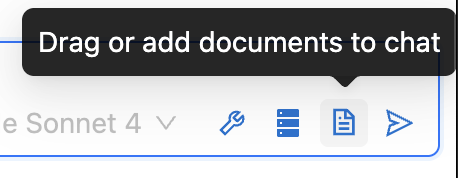

### RAG Studio UI Guide

#### Table of Contents

- [Navigation Overview](#navigation-overview)
- [Configuration Check and Redirection (CML + CAII)](#configuration-check-and-redirection-cml--caii)
- [Knowledge Bases](#knowledge-bases)
  - [Create a Knowledge Base](#create-a-knowledge-base)
  - [Upload and Manage Documents](#upload-and-manage-documents)
  - [Edit Knowledge Base Settings](#edit-knowledge-base-settings)
  - [Other Knowledge Base Tabs](#other-knowledge-base-tabs)
- [Chats](#chats)
  - [Start a New Chat](#start-a-new-chat)
  - [Ask Questions](#ask-questions)
  - [Input Controls and Quick Settings](#input-controls-and-quick-settings)
  - [Use Knowledge Bases in a Chat](#use-knowledge-bases-in-a-chat)
  - [Upload Documents to the Active Chat](#upload-documents-to-the-active-chat)
  - [Suggested Questions and Sources](#suggested-questions-and-sources)
  - [Chat Settings (Session-Level)](#chat-settings-session-level)
  - [Inference Model Quick Switch](#inference-model-quick-switch)
  - [Tools (Beta)](#tools-beta)
- [Analytics](#analytics)
- [Settings](#settings)
  - [Studio Settings Configurations](#studio-settings-configurations)
  - [Add Tools from the UI](#add-tools-from-the-ui)

This guide explains how to use RAG Studio entirely from the UI, focusing on navigation, creating and managing knowledge bases, starting chats, tuning settings, using tools, and reviewing analytics.

## 

---

### Navigation Overview

- **Chats**: Ask questions, manage sessions, upload files to the active chat, and control models/tools.
- **Knowledge Bases**: Create and manage knowledge bases, upload documents, and configure indexing.
- **Analytics**: Review app and session metrics with filters.
- **Settings**: Configure studio settings, models, and tools.

## 

---

### Configuration Check and Redirection (CML + CAII)

- If the CML deployment and CAII (Cloudera AI Inference) endpoints for LLM, Embeddings, and/or Rerankers are in the same environment, the app validates Studio configuration with CAII.
- If there is no valid configuration, clicking "Get Started" will redirect you to the Settings page to configure the Studio.

## 

## 

---

### Knowledge Bases

#### Create a Knowledge Base

1. Go to **Knowledge Bases**.
2. Click **Create Knowledge Base**.
3. Fill in the required fields:
   - **Name**
   - **Chunk Size (tokens)**
   - **Embedding Model** (required)
   - Optional: **Summarization Model** to enable summary-based retrieval
   - Advanced (optional): **Chunk Overlap**, **Distance Metric** (Cosine)
4. Click **Save**.

## 

## 

#### Upload and Manage Documents

1. Open a knowledge base and navigate to the **Manage** tab.
2. Drag-and-drop or select files, then click **Start Upload**.
3. Use the table to view, delete, or summarize documents (if a summarization model is configured).

## 

#### Edit Knowledge Base Settings

1. Open a knowledge base and navigate to **Index Settings**.
2. Update fields such as name, models, availability, etc.
3. Click **Update** to save. You can also delete the knowledge base from this page.

## 

#### Other Knowledge Base Tabs

- **Connections**: Configure external connectors (if applicable).
- **Metrics**: Knowledge base–level statistics.
- **Visualize**: Explore vector graph visualization.

## 

---

### Chats

#### Start a New Chat

Type a question and send. If no session exists, a new session is created automatically on your first send.

**Optional:** Before sending, click **Chat Settings** to open the Create Session modal and preselect knowledge base(s) and the response synthesizer model.

## 

## 

#### Ask Questions

- Use the input box at the bottom. Press **Enter** to send; **Shift+Enter** inserts a newline.
- Click the send icon to submit.
- Click the stop icon to cancel a streaming response.
- If knowledge bases exist, the placeholder reads "Ask a question"; otherwise, it reads "Chat with the LLM".

## 

#### Input Controls and Quick Settings

- **Knowledge Base Selector**: When no session exists, pick one or more knowledge bases next to the input before sending the first message.
- **Inference Model Selector**: Choose the response model next to the input. If a session exists, this updates the session; if not, it's used for the new session.
- **Tools** (wrench icon): When Tool Calling is enabled, click to open Tool Selection and enable/disable tools for the session.
- **Include/Exclude Knowledge Base Toggle** (database icon): Per-message control to include or exclude knowledge base retrieval.
- **Stop Streaming Button**: Appears while a response is streaming.

## 

#### Use Knowledge Bases in a Chat

- Toggle the database icon to include or exclude the knowledge base for the current message.

## 

## 

- For new sessions, you can optionally select knowledge base(s) next to the input before sending the first message.

## 

#### Upload Documents to the Active Chat

- Drag files anywhere in the chat area; a drop overlay will appear. Drop to upload into the associated knowledge base for the session.
- Alternatively, open the **Documents** control (paperclip/folder icon) near the input to manage uploads.

## 

## 

#### Suggested Questions and Sources

- **Empty Chat**: When a session exists with no messages, Suggested Questions cards appear in the chat body. They are generated from the selected knowledge base(s). If none are selected or available, a default starter list is shown.
- **After Messages**: Follow-up suggestions appear near the input, tailored to the current session. If no knowledge base is in use, a default list is shown.
- **Sources and Feedback**: Each answer shows citations ("Sources") and optional evaluations (e.g., relevance, faithfulness). Use the copy and rating/feedback controls under each answer.

## 

## 

## 

#### Chat Settings (Session-Level)

Click **Chat Settings** in the header to modify the active session:

- Rename session
- Select knowledge base(s)
- Choose response synthesizer model
- Optional reranking model
- Maximum number of documents
- Advanced options:
  - Tool Calling (beta)
  - HyDE
  - Summary-based filtering
  - Disable streaming

## 

#### Inference Model Quick Switch

- Next to the input, change the model on the fly. If the new model supports tool calling, the session setting updates accordingly.

## 

#### Tools (Beta)

- If Tool Calling is enabled, click the wrench icon to open Tool Selection. Check tools to enable them for the session.
- Available tools are managed in **Settings → Tools**.

## 

## 

---

### Analytics

Use the Analytics page to view:

- **App Metrics**: Overall usage and health metrics.
- **Session Metrics**: Filter by response model, rerank model (or None), summary filter usage, HyDE, knowledge base usage, and project.

## 

## 

---

### Settings

- **Studio Settings**: Environment and studio configuration.
- **Model Configuration**: Manage embedding and LLM models used across the app.
- **Tools**: Enable and configure tools available for Tool Calling.

## 

## 

## 

### Studio Settings Configurations

Use **Settings → Studio Settings** to configure the application. Some fields are only editable when there are no chats or knowledge bases.

#### Processing Settings

- **Enhanced PDF Processing**: Improves text extraction for PDFs; requires a GPU and at least 16 GB RAM. Disabled with a warning if resources are insufficient.

#### Metadata Database

- **Embedded (H2)**: Default metadata database.
- **External PostgreSQL**: Provide JDBC URL, Username, and Password. Use **Test Connection** to validate; success/failure indicators are shown inline.

## 

#### File Storage

- **Project Filesystem (Local)**: Stores files in the project filesystem.
- **AWS S3**: Set Document Bucket Name and optional Bucket Prefix.
  - **Store Document Summaries in S3**: Toggle when summarization is enabled for knowledge bases.
  - **Store Chat History in S3**: Toggle to persist chat history in S3.

## 

#### Vector Database

- **Qdrant**: Embedded Qdrant (default).
- **Cloudera Semantic Search (OpenSearch)**: Set Endpoint, Namespace (alphanumeric), optional Username/Password. Supported up to OpenSearch 2.19.3.

## 

- **ChromaDB**: Set Host (URL or hostname), optional Port, Token, Tenant, Database. SSL is inferred from `https://` in the host.

## 

#### Model Provider

Choose a provider (e.g., CAII, OpenAI, Azure, Bedrock). Credentials are set under Authentication.

- **CAII**

  - If there are no hosted CAII endpoints in the same environment, you can optionally provide one that has hosted endpoints along with the CDP Auth Token.

  ## 

- **OpenAI**

  - **API Key**: Provide your OpenAI API Key for authentication.
  - **Base URL**: Optional custom base URL for OpenAI-compatible endpoints.

  ## 

- **Azure OpenAI**

  - **API Key**: Your Azure OpenAI service API key.
  - **Endpoint**: The Azure OpenAI service endpoint URL.
  - **API Version**: The API version to use (e.g., 2024-02-01).

  ## 

- **AWS Bedrock**
  - **Region**: AWS region where your Bedrock models are hosted.
  - Access credentials are configured in the Authentication section.
  ## 

#### Authentication

- **AWS**: Region, Access Key ID, Secret Access Key (visible when using Bedrock/S3/Summary S3).

## 

- **Azure**: Azure OpenAI Key (when Azure is selected).
- **OpenAI**: OpenAI API Key (when OpenAI is selected).
- **CAII**: CDP Auth Token may be required depending on the environment.

#### Applying Changes

- Click **Submit** to review and confirm. A restart modal will guide you through applying changes.

## 

## 

- If chats or knowledge bases exist, a warning will appear and certain settings are disabled until data is removed.

## 

### Add Tools from the UI

## 

1. Go to **Settings → Tools**.
2. Click **Add Tool**.
3. In the modal, provide:
   - **Internal Name** (alphanumeric and dashes)
   - **Display Name**
   - **Description** : (Recommended) Please a provide a few lines detailing the use of the tool as it helps the LLM understand how to use the tool
4. Choose **Tool Type**:

   - **Command-based**: Enter Command, optional Arguments (comma-separated), and add Environment Variables (key/value) as needed.
     - For example, to add Serper Search & Scrape MCP:
       ```
       Command: npx
       Arguments: -y, serper-search-scrape-mcp-server
       Environment Variables:
           - SERPER_API_KEY: your_api_key_here
       ```

   ## 

   - **URL-based**: Enter one or more URLs (comma-separated). (Not recommended)

   ## 

5. Click **Add**. The tool appears in the Available Tools table (you can delete it later).
6. To use a tool in chat, enable **Tool Calling** in Chat Settings, then click the wrench icon in the input bar and select the tool(s).

---
